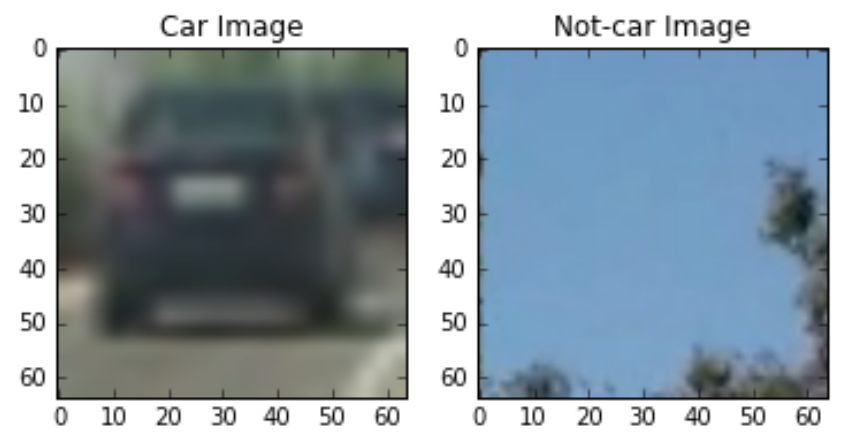
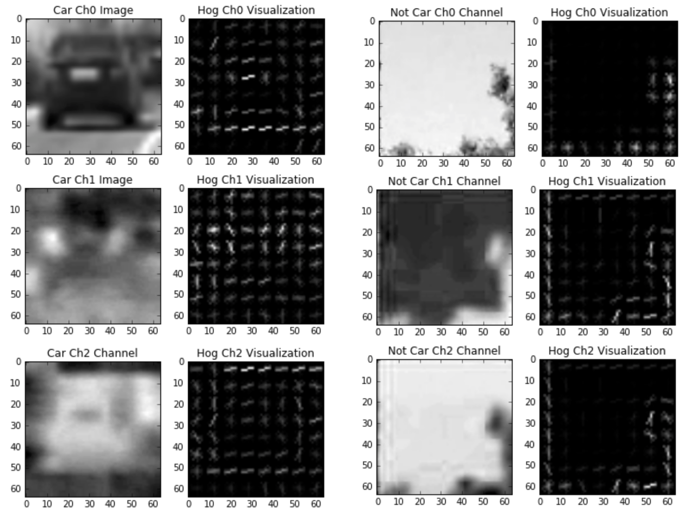
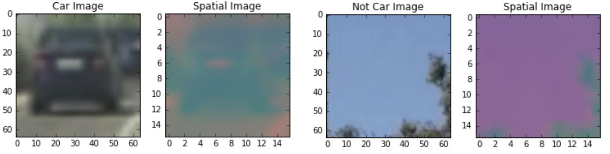
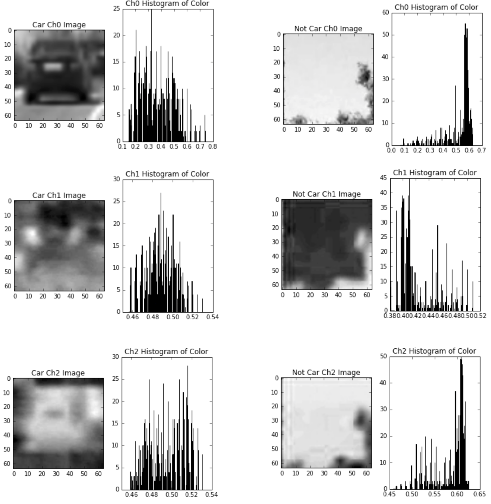

# Term-1 Assignment-5: CarND-Vehicle-Detection

## Vehicle Detection Project

### Goal
The goal is to write a software pipeline to identify vehicles in a video from a front-facing camera on a car.

### Steps to complete this project are the following:
1. Perform color transform and apply Histogram of Oriented Gradients (HOG) feature extraction on a labeled training set of images 
2. Append binned color features, as well as histograms of color, to the HOG feature vector and normalize the features 
3. Train a classifier to classify vehicles vs. non-vehicles
4. Implement a sliding-window technique and use the trained classifier to search for vehicles in images.
5. Run the pipeline on a video stream and create a heat map of recurring detections frame by frame to reject outliers and follow detected vehicles.
6. Estimate a bounding box for vehicles detected.

### Step 1: Perform color transform and apply Histogram of Oriented Gradients (HOG) feature extraction on a labeled training set of images 

The code for this step is contained in the 2, 5, 6 & 7th code cells of the IPython notebook located in "./vehicle_detection_for_submission.ipynb".

I used the labeled data set <a href=https://s3.amazonaws.com/udacity-sdc/Vehicle_Tracking/vehicles.zip>vehicles</a> and <a href=https://s3.amazonaws.com/udacity-sdc/Vehicle_Tracking/non-vehicles.zip>non-vehicles</a> to extract the HOG features.  I did try to use the udacity generated data <a href=https://github.com/udacity/self-driving-car/tree/master/annotations>here</a>.  However, I found that the classifier accuracy is very low when using the udacity data.  I ended up not using the udacity data for training. 

Here is an example of a car image and an exmaple of a non-car image:



I tried different color spaces, such as, HLS, HSV, YCrCb and found that YCrCb generated the best result when i tried using the trained model to detect vehicles in the test images. Also, I tested 0,1,2 and 'All' HOG channels and found that 0 performed the worst. 1 & 2 performed well with the validation set with accuracy > 0.98 but bad when detecting vehicles in the test images.  "All" performed good with the validation set with accuracy = 0.9575 but very well when detecting vehicles in the test images. 

Here are the HOG parameters I used to generate the HOG features:

```
color_space = 'YCrCb' # Can be RGB, HSV, LUV, HLS, YUV, YCrCb
block orient = 9  # HOG orientations
pix_per_cell = 8 # HOG pixels per cell
cell_per_block = 2 # HOG cells per block
hog_channel = "ALL" # Can be 0, 1, 2, or "ALL"
```

The extracted hog features are:



### Step 2: Append binned color features, as well as histograms of color, to the HOG feature vector 

The code for this step is contained in the 2, 5, 6 & 7th code cells of the IPython notebook located in "./vehicle_detection_for_submission.ipynb".

I tried different color spaces in this step.  I found that HLS and HSV actually performed better than YCrCb.  But since HOG is much better on YCrCb, I used YCrCb for all 3 features extraction instead of converting the image in different color spaces for different feature extraction. 

```
spatial_size = (16, 16) # Spatial binning dimensions
hist_bins = 16    # Number of histogram bins
```

Here is an example of the spatial binned color feature::



Here is an example of the histograms of color features:



Please refer to code cell #7 for scaling the feature:

```
# Fit a per-column scaler
X_scaler = StandardScaler().fit(X)
# Apply the scaler to X
scaled_X = X_scaler.transform(X)

```


### Step 3: Train a classifier to classify vehicles vs. non-vehicles

1. Because there are a lot of time series data in the label data, I manually separate the vehicle and non-vehicle data into training and test set.  I put the first 20% of vehicle data and non-vehicle data to the test set and the rest to the training set.  You can find the code in cell #8 of the IPython notebook located in "./vehicle_detection_for_submission.ipynb".

    ```

    car_split = len(car_features) * 0.2
    notcar_split = len(notcar_features) * 0.2

    X_test = np.vstack((scaled_X[:int(car_split)], scaled_X[len(car_features):(len(car_features) + int(notcar_split))]))
    y_test = np.hstack((y[:int(car_split)], y[len(car_features):(len(car_features) + int(notcar_split))]))

    X_train = np.vstack((scaled_X[int(car_split):len(car_features)], scaled_X[(len(car_features) + int(notcar_split)):]))
    y_train = np.hstack((y[int(car_split):len(car_features)], y[(len(car_features) + int(notcar_split)):]))

    ```


2. I tried different classifiers to classify vehicles vs. non-vehicles and found that linear SVM didn't have a good accuracy.  I also tried a simple convolutional neural network using features extracted from step 1 & step 2.  However, I found that the accuracy is < 0.9.  The best classifier that I found is the SVC with default settings (i.e. kernel = 'rbf' and gamma = 'auto' and C = 1.0).  The accuracy got up to 0.95 and more.  You can find the code in cell #9 of the IPython notebook located in "./vehicle_detection_for_submission.ipynb".

```
print('Using:',orient,'orientations',pix_per_cell,
    'pixels per cell and', cell_per_block,'cells per block')
print('Feature vector length:', len(X_train[0]))
# Use SVC 
svc = SVC()
# Check the training time for the SVC
t=time.time()
svc.fit(X_train, y_train)
t2 = time.time()
print(round(t2-t, 2), 'Seconds to train SVC...')
# Check the score of the SVC
print('Test Accuracy of SVC = ', round(svc.score(X_test, y_test), 4))
# Check the prediction time for a single sample
t=time.time()

```


