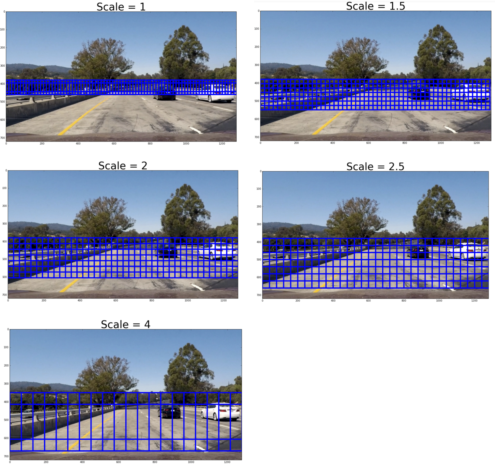
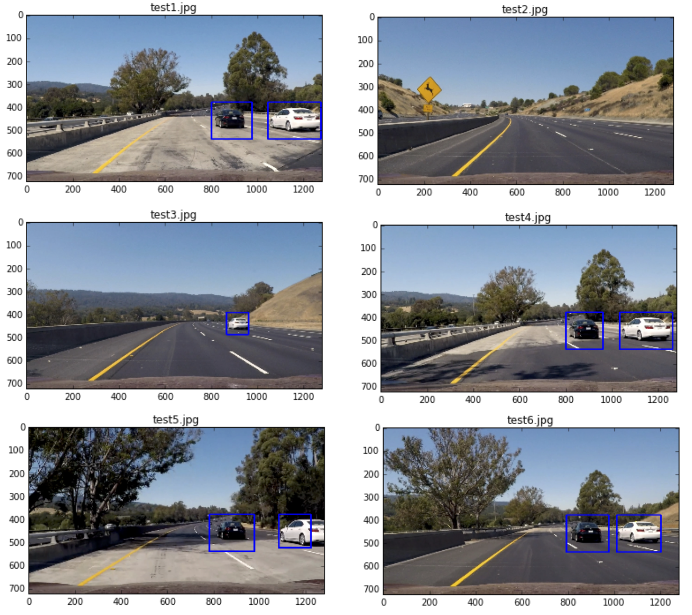

# Term-1 Assignment-5: CarND-Vehicle-Detection

## Vehicle Detection Project

### Goal
The goal is to write a software pipeline to identify vehicles in a video from a front-facing camera on a car.

### Steps to complete this project are the following:
1. Perform color transform and apply Histogram of Oriented Gradients (HOG) feature extraction on a labeled training set of images 
2. Append binned color features, as well as histograms of color, to the HOG feature vector and normalize the features 
3. Train a classifier to classify vehicles vs. non-vehicles
4. Implement a sliding-window technique and use the trained classifier to search for vehicles in images.
5. Run the pipeline on a video stream and create a heat map of recurring detections frame by frame to reject outliers and follow detected vehicles.
6. Estimate a bounding box for vehicles detected.

### Step 1: Perform color transform and apply Histogram of Oriented Gradients (HOG) feature extraction on a labeled training set of images 

The code for this step is contained in the 2, 5, 6 & 7th code cells of the IPython notebook located in "./vehicle_detection_for_submission.ipynb".

I used the labeled data set <a href=https://s3.amazonaws.com/udacity-sdc/Vehicle_Tracking/vehicles.zip>vehicles</a> and <a href=https://s3.amazonaws.com/udacity-sdc/Vehicle_Tracking/non-vehicles.zip>non-vehicles</a> to extract the HOG features.  I did try to use the udacity generated data <a href=https://github.com/udacity/self-driving-car/tree/master/annotations>here</a>.  However, I found that the classifier accuracy is very low when using the udacity data.  I ended up not using the udacity data for training. 

Here is an example of a car image and an exmaple of a non-car image:


I tried different color spaces, such as, HLS, HSV, YCrCb and found that YCrCb generated the best result when i tried using the trained model to detect vehicles in the test images. Also, I tested 0,1,2 and 'All' HOG channels and found that 0 performed the worst. 1 & 2 performed well with the validation set with accuracy > 0.98 but bad when detecting vehicles in the test images.  There were a lot of false positives.  I found that "All" performed well with the validation set with accuracy = 0.9575 but very well when detecting vehicles in the test images.  Not much false positives were found.  Therfore, i decided to use all 3 channels for HOG features

Here are the HOG parameters I used to generate the HOG features:

```
color_space = 'YCrCb' # Can be RGB, HSV, LUV, HLS, YUV, YCrCb
block orient = 9  # HOG orientations
pix_per_cell = 8 # HOG pixels per cell
cell_per_block = 2 # HOG cells per block
hog_channel = "ALL" # Can be 0, 1, 2, or "ALL"
```

The extracted hog features are:


### Step 2: Append binned color features, as well as histograms of color, to the HOG feature vector 

The code for this step is contained in the 2, 5, 6 & 7th code cells of the IPython notebook located in "./vehicle_detection_for_submission.ipynb".

I tried different color spaces in this step.  I found that HLS and HSV actually performed better than YCrCb.  But since HOG is much better on YCrCb, I used YCrCb for all 3 features extraction instead of converting the image in different color spaces for different feature extraction. 

```
spatial_size = (16, 16) # Spatial binning dimensions
hist_bins = 16    # Number of histogram bins
```

Here is an example of the spatial binned color features:


Here is an example of the histograms of color features:


Please refer to code cell #7 for scaling the features:

```
# Fit a per-column scaler
X_scaler = StandardScaler().fit(X)
# Apply the scaler to X
scaled_X = X_scaler.transform(X)

```


### Step 3: Train a classifier to classify vehicles vs. non-vehicles

1. Because there are a lot of time series data in the label data, I manually separated the vehicle and non-vehicle data into training and test set.  I put the first 20% of vehicle data and non-vehicle data to the test set and the rest to the training set.  

    You can find the code in cell #8 of the IPython notebook located in "./vehicle_detection_for_submission.ipynb".

    ```

    car_split = len(car_features) * 0.2
    notcar_split = len(notcar_features) * 0.2

    X_test = np.vstack((scaled_X[:int(car_split)], scaled_X[len(car_features):(len(car_features) + int(notcar_split))]))
    y_test = np.hstack((y[:int(car_split)], y[len(car_features):(len(car_features) + int(notcar_split))]))

    X_train = np.vstack((scaled_X[int(car_split):len(car_features)], scaled_X[(len(car_features) + int(notcar_split)):]))
    y_train = np.hstack((y[int(car_split):len(car_features)], y[(len(car_features) + int(notcar_split)):]))

    ```


2. I tried different classifiers to classify vehicles vs. non-vehicles and found that linear SVM didn't have good accuracy.  I also tried a simple convolutional neural network using features extracted from step 1 & step 2.  However,the accuracy is not that good < 0.9.  The best classifier that I found was SVC with default settings (i.e. kernel = 'rbf' and gamma = 'auto' and C = 1.0).  The accuracy got up to 0.95 and more.  

    You can find the code in cell #9 of the IPython notebook located in "./vehicle_detection_for_submission.ipynb".

    ```
    print('Using:',orient,'orientations',pix_per_cell,
        'pixels per cell and', cell_per_block,'cells per block')
    print('Feature vector length:', len(X_train[0]))
    # Use SVC 
    svc = SVC()
    # Check the training time for the SVC
    t=time.time()
    svc.fit(X_train, y_train)
    t2 = time.time()
    print(round(t2-t, 2), 'Seconds to train SVC...')
    # Check the score of the SVC
    print('Test Accuracy of SVC = ', round(svc.score(X_test, y_test), 4))
    # Check the prediction time for a single sample
    t=time.time()

    ```

### Step 4: Implement a sliding-window technique and use the trained classifier to search for vehicles in images.

1. I chose 5 sizes of the sliding window sizes with scales (1, 1.5, 2, 2.5 and 4) of default window 64 x 64.  I originally didn't choose scale of 4 times bigger than 64 x 64 but found that the pipeline couldn't detect vehicles that were very close to the car.  

2. I set the cells per step to be 1 because it gave the best detection when i applied the heat map to remove false positives.  And I added 1 more window to the right and to the bottom of the image so that it could detect the edge better. 

3. Also, I limited the area that each sliding window can search.  Below shows the search area each sliding window  would search for but please note that for illusation purposes I only included every other windows in the image. 

    ```
    scales = [1, 1.5, 2, 2.5, 4]
    y_start_stops = [[380, 460], [380, 560], [380, 620], [380, 680], [350, 700]]
    
    ```

    

    You can find the code in cell #3 & cell #10 of the IPython notebook located in "./vehicle_detection_for_submission.ipynb".


    ```
    # Define a single function that can extract features using hog sub-sampling and make predictions   
    def find_cars(img, y_start_stops, scales, svc, X_scaler, 
                  color_space, spatial_size, hist_bins, 
                  orient, pix_per_cell, cell_per_block,
                  hog_channel, spatial_feat, hist_feat, hog_feat):

        draw_img = np.copy(img)
        img = img.astype(np.float32)/255

        hot_windows = []
        for y_start_stop, scale in zip(y_start_stops, scales):

            img_tosearch = img[y_start_stop[0]:y_start_stop[1],:,:]

            ctrans_tosearch = convert_color(img_tosearch, color_space=color_space)
            if scale != 1:
                imshape = ctrans_tosearch.shape
                ctrans_tosearch = cv2.resize(ctrans_tosearch, (np.int(imshape[1]/scale), np.int(imshape[0]/scale)))

            ch1 = ctrans_tosearch[:,:,0]
            ch2 = ctrans_tosearch[:,:,1]
            ch3 = ctrans_tosearch[:,:,2]

            # Define blocks and steps as above
            nxblocks = (ch1.shape[1] // pix_per_cell)-1
            nyblocks = (ch1.shape[0] // pix_per_cell)-1 
            nfeat_per_block = orient*cell_per_block**2

            # Compute individual channel HOG features for the entire image
            hog1 = get_hog_features(ch1, orient, pix_per_cell, cell_per_block, feature_vec=False)
            hog2 = get_hog_features(ch2, orient, pix_per_cell, cell_per_block, feature_vec=False)
            hog3 = get_hog_features(ch3, orient, pix_per_cell, cell_per_block, feature_vec=False)

            # 64 was the orginal sampling rate, with 8 cells and 8 pix per cell
            window = 64
            nblocks_per_window = (window // pix_per_cell)-1 
            cells_per_step = 1  # Instead of overlap, define how many cells to step
            nxsteps = (nxblocks - nblocks_per_window) // cells_per_step
            nysteps = (nyblocks - nblocks_per_window) // cells_per_step

            for xb in range(nxsteps+1):
                for yb in range(nysteps+1):

                    if xb == (nxsteps + 1):
                        xpos = ch1.shape[1] - nblocks_per_window                  
                    else:
                        xpos = xb*cells_per_step

                    if yb == (nysteps + 1):
                        ypos = ch1.shape[0] - nblocks_per_window               
                    else:
                        ypos = yb*cells_per_step                    


                    # Extract HOG for this patch
                    hog_feat1 = hog1[ypos:ypos+nblocks_per_window, xpos:xpos+nblocks_per_window].ravel() 
                    hog_feat2 = hog2[ypos:ypos+nblocks_per_window, xpos:xpos+nblocks_per_window].ravel() 
                    hog_feat3 = hog3[ypos:ypos+nblocks_per_window, xpos:xpos+nblocks_per_window].ravel() 

                    if hog_channel == 'ALL':
                        hog_features = np.hstack((hog_feat1, hog_feat2, hog_feat3))
                    elif hog_channel == '0':
                        hog_features = hog_feat1
                    elif hog_channel == '1':
                        hog_features = hog_feat2
                    elif hog_channel == '2':
                        hog_features = hog_feat3

                    xleft = xpos*pix_per_cell
                    ytop = ypos*pix_per_cell

                    # Extract the image patch
                    subimg = cv2.resize(ctrans_tosearch[ytop:ytop+window, xleft:xleft+window], (64,64))

                    # Get color features
                    spatial_features = bin_spatial(subimg, size=spatial_size)
                    hist_features = color_hist(subimg, nbins=hist_bins)

                    img_features = []
                    if spatial_feat:
                        img_features.append(spatial_features)
                    if hist_feat:
                        img_features.append(hist_features)
                    if hog_feat:
                        img_features.append(hog_features)

                    img_features = np.concatenate(img_features).reshape(1, -1)

                    # Scale features and make a prediction
                    test_features = X_scaler.transform(img_features)    
                    test_prediction = svc.predict(test_features)

                    xbox_left = np.int(xleft*scale)
                    ytop_draw = np.int(ytop*scale)
                    win_draw = np.int(window*scale)


                    if test_prediction == 1:
                        hot_windows.append(((xbox_left, ytop_draw+y_start_stop[0]),(xbox_left+win_draw,ytop_draw+win_draw+y_start_stop[0])))   

        return hot_windows
    ```

### Step 5: Run the pipeline on a video stream and create a heat map of recurring detections frame by frame to reject outliers and follow detected vehicles.

1. I ran the video stream through the pipeline and here are the examples of the vehicle detection and the corresponding heatmap.  
2. Since the pipeline detected the vehicle pretty well, I created a heatmap for each frame and applied threshold = 3 to filter out any false positives. 
3. Please refer to cell #4 and cell #10 of the IPython notebook located in "./vehicle_detection_for_submission.ipynb".

    ```
    # Read in image similar to one shown above 
    heat = np.zeros_like(image[:,:,0]).astype(np.float)
    
    # Add heat to each box in box list
    heat = add_heat(heat,hot_windows)
    
    # Apply threshold to help remove false positives
    heat = apply_threshold(heat,3)    
    ```

    


### Step 6: Estimate a bounding box for vehicles detected.

1. After finding the heatmap from step 5, I applied the scipy.ndimage.measurements.label method to find the bounding boxes of the vehicles. 




## Pipeline (Video) 

Here is a link to the video result:

<a href="https://youtu.be/ncP0g2GUmQw" target="_blank"></a>


## Discussion

1. The 


